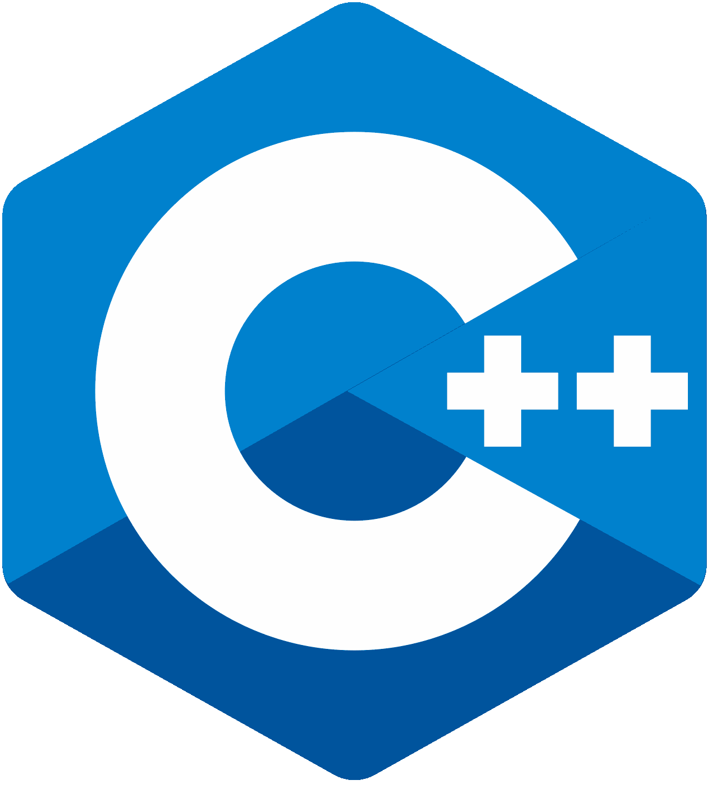

<!-- <h1 align="center">Hi thereI'm Diksha Takyar </h1> -->
<h1 align="center">Hi there! I'm Diksha Takyar </h1>

   

 

<b> About Me: </b>
- 😄 Pronouns: She/Her
- 👩‍💻 Currently learning Redux!
- 🤝 Looking to collaborate on front-end projects
- ⚡ Fun fact: I like to make memes! 🤪 

<h3 align="left">Skills: </h3>

 
 
<h3 style="left: 50px; position:relative;">Connect with me:</h3> 

<!--  -->

 
 

## Stats:

<a href="https://github.com/dikshatakyar">
  
  
  
<!--  -->

<!--  -->

  <!--   

 </a>

 -->

 

    :arrow_down: Scroll down to see my top repositories :arrow_down:
     
    <b>
      Show some ❤️ by starring some of the repos!
    </b>

